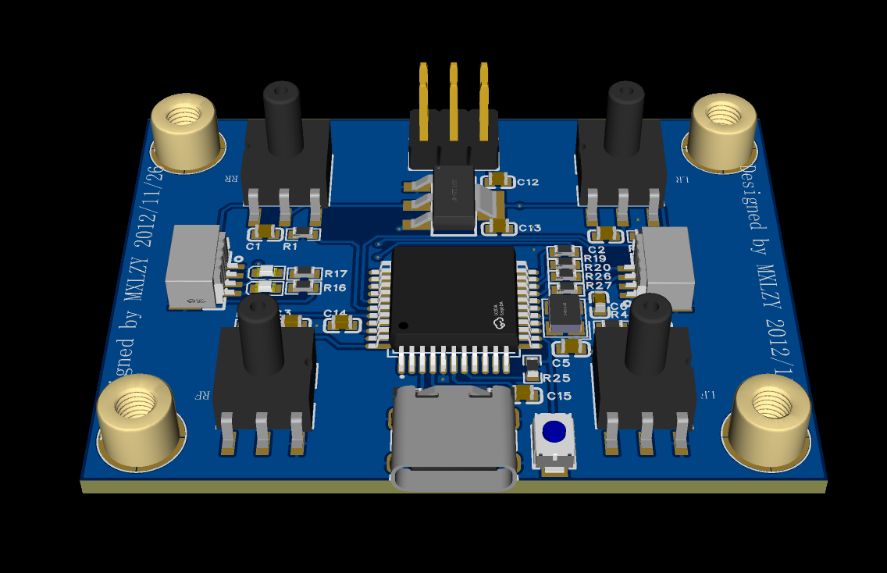
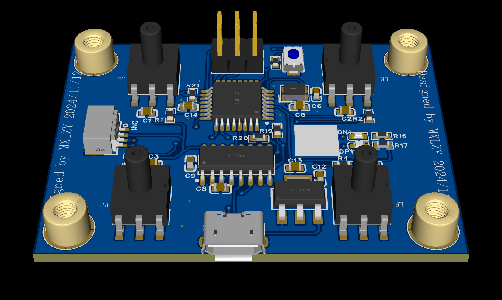

Unitree Go 1 Free Dog Add Contact. /unitree go1系列添加足端力传感器
# Unitree Go 1 Free Dog SDK CPP
Welcome to the repository designed for general users without needing "Krypton gold." 

This repository serves as an experimental platform and should be utilized primarily for educational purposes or non-commercial development. 

We thank Bin4ry and linzhuyue for their invaluable contributions to the protocol analysis and the Python、C++ iteration.

# Note!!
1. Only test on go 1 pro.
2. But it can be extended to other robots.
3. Thanks, Bin4ry for the Python version.
4. Thanks, linzhuyue for the C++ version.
5. New build by mengxin test on go 1 pro

## New build 
1.free_dog_sdk_cpp-main file mainly modify\free_dog_sdk_cpp-main\fdsc_utils highstate.h, lowstate.h, highstate.cpp, lowstate.cpp files.
2.The serial_reader file mainly contains the serial port information for ubuntu to read arduino, and is published through ros.

## How to use?
free_dog_sdk:
1. I made it as a ROS pkg; you can delete the ROS-relative things, and then you can use it anywhere you wanna.
2. Clone into your ROS ws. And catkin build
3. If you used wired, you should set up your IP just like 192.168.123.xxx
4. Then catkin build again and ```source devel/setup.bash```
5. ```rosrun fdsc_utils fdsc_utils_pushup_node``` (This is most safe motion. If you use wireless with robot please modify connection settings as "LOW_WIFI_DEFAULTS")
serial_reader:
1.Clone into your ROS ws. And catkin build
2.roscore and sudo xxx_ws serial_reader_node
3.You can see the cmd interface continues to publish data, if the error, you can try sudo chmod 777 /dev/ttyUSB*.

## PCB build
<p align = "center">

</p>
<p align = "center">

</p>
   
## LICENSE
MIT LICENSE

## Referneces
1. [Bin4ry Python Version(Many Thks)](https://github.com/Bin4ry/free-dog-sdk/tree/main)
2. [legged_controller](https://github.com/qiayuanl/legged_control)
3. [free_dog_sdk](https://github.com/linzhuyue/free_dog_sdk_cpp)
